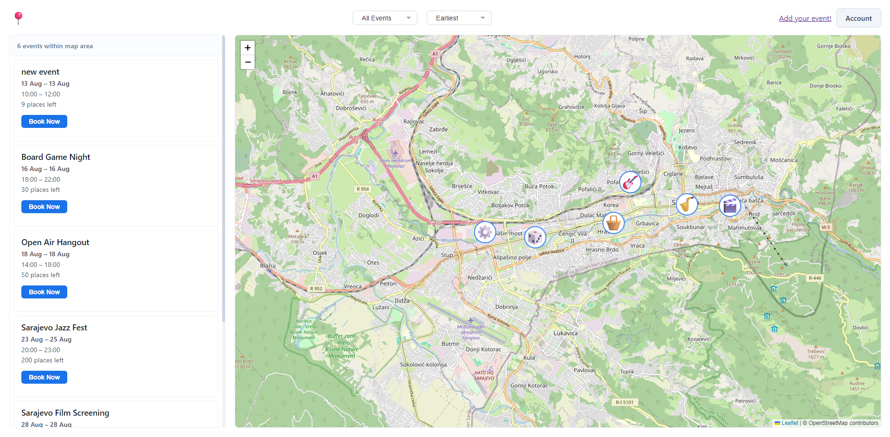

Event Booking System

ASP.NET Core web app za rezervaciju dogadjaja, sa PostgreSQL bazom.

Sta ti treba prije pokretanja

- .NET SDK (8.0 ili noviji)
- PostgreSQL instaliran lokalno

Setup

1. Kloniraj repo:

git clone https://github.com/imangunjevic23/event-booking-system.git
cd event-booking-system

2. Napravi praznu PostgreSQL bazu, npr. eventbookingsystem.

3. Otvori appsettings.json i zamijeni YOUR_PASSWORD_HERE svojom pravom lozinkom za postgres usera.

4. Pokreni migracije:

dotnet ef database update

5. Pokreni aplikaciju:

dotnet run

6. Otvori link koji se ispise u terminalu (obicno https://localhost:5001).

Napomena

Mape koriste OpenStreetMap/Leaflet, ne treba API kljuc.
